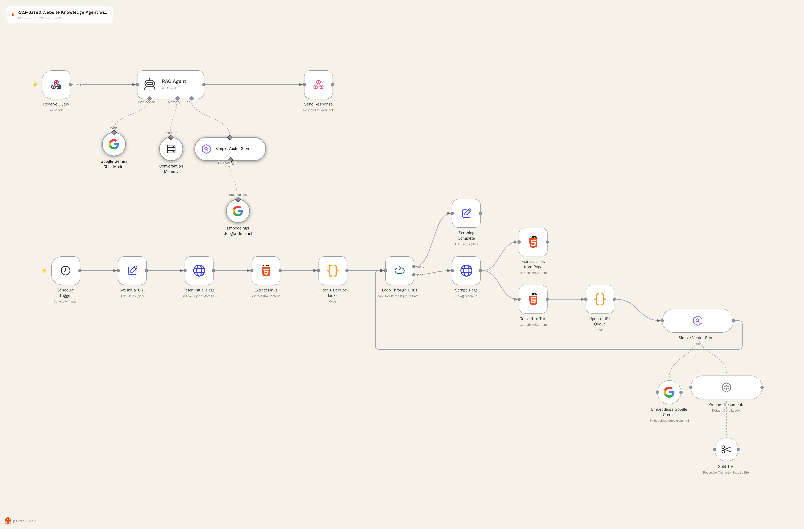

# Web Agent — Embeddable RAG Support Widget

A prototype support widget: drop one script tag on a site, and it answers visitor questions grounded in that site's own content. Includes a lightweight tier for recognizing returning, authenticated visitors.

**[Live demo →](https://prajwalsinghkalwad.github.io/Pro-Coding-Studio-Documentation/)**

---

## What it does

- Answers visitor questions using content retrieved from a vector store, not the model's general knowledge (RAG)
- Distinguishes guests from authenticated visitors via a token the *client site's own login system* issues — the agent doesn't run its own auth system
- Authenticated visitors get greeted by name and get continuity of conversation across separate visits
- Guest conversations stay short-lived, scoped to that browser session only
- Ships as a single embeddable script with all configuration passed via `data-*` attributes — no per-client code changes needed

---

## Architecture



```
Visitor's browser
   │  (agent-widget.js: one <script> tag, config via data-* attributes)
   ▼
n8n workflow
   │ Receive Query → Auth Check (tier: guest/authenticated)
   │       │
   │       ▼
   │  RAG Agent (Gemini) ── retrieves from ──▶ in-memory vector store
   │       │                                    (populated by a scraping/
   │       │                                     indexing sub-workflow)
   │       ▼
   │  Authenticated-user history read/write ──▶ n8n workflow static data
   │       │
   ▼       ▼
Response back to widget
```

- **Frontend:** vanilla JS widget, no framework or build step — one file, configured entirely through `data-*` attributes on its own `<script>` tag
- **Orchestration:** n8n workflow handles the webhook, tiering logic, retrieval, and response
- **LLM + embeddings:** Google Gemini
- **Storage:** everything lives inside n8n itself — an in-memory vector store for retrieved content, and n8n's built-in workflow static data for durable per-authenticated-user conversation history. No external database.
- **Hosting:** static frontend on GitHub Pages; n8n backend on n8n Cloud

---

## Setup

1. Import `Radha_web_agent_n8n_final.json` into n8n
2. Add a Google Gemini credential inside n8n's Credentials tab
3. Run the scraping/indexing sub-workflow once to populate the in-memory vector store with your site's content
4. Set `KNOWN_SITE_KEYS` and `AUTH_USERS` in the relevant Code nodes (see comments in each node)
5. Add `data-*` attributes to the widget's script tag on your target site — see the top comment block in `agent-widget.js` for the full list of options

---

## How to use

### Embed it on a site

Add one script tag before the closing `</body>` tag. This is the minimum required to get a working widget:

```html
<script src="agent-widget.js"
  data-url="https://your-n8n-instance/webhook/website-query"
  data-site-key="your-site-key">
</script>
```

That's a fully working guest-facing widget — no other steps needed on the page itself. Everything else (name, color, icon, welcome message, position) is optional and falls back to sensible defaults if left out:

```html
<script src="agent-widget.js"
  data-url="https://your-n8n-instance/webhook/website-query"
  data-site-key="your-site-key"
  data-site-id="acme-co"
  data-name="Acme Assistant"
  data-color="#2F3B8C"
  data-welcome="Hi! Ask me anything about this site."
  data-position="right"
  data-icon="https://yoursite.com/logo.png"
  data-label="Chat with us">
</script>
```

### Recognizing a logged-in visitor (optional)

If the host site has its own login system and wants returning visitors remembered by the agent, set a token *before* the widget script runs:

```html
<script>
  window.AgentWidgetUserToken = "whatever-token-your-own-login-issued";
</script>
<script src="agent-widget.js" data-url="..." data-site-key="..."></script>
```

The widget forwards this token as a header; it never generates, stores, or interprets it itself — that mapping (token → visitor name) lives in the n8n `Auth Check` node's `AUTH_USERS` list. Leave this out entirely and every visitor is treated as a guest.

### What the visitor sees

A chat bubble appears in the configured corner of the page. Clicking it opens a small panel where they can ask a question in plain language. The agent answers using content indexed from that site — guests get a normal one-off style reply, while a recognized authenticated visitor gets greeted by name and can reference earlier conversations from a previous visit.

---

## Configuration reference (widget)

| Attribute | Required | Default | Purpose |
|---|---|---|---|
| `data-url` | Yes | — | n8n webhook endpoint |
| `data-site-key` | Yes | — | Identifies which client site is calling |
| `data-site-id` | No | `""` | Tenant identifier, sent alongside the site key |
| `data-name` | No | `"Site Assistant"` | Header title in the chat panel |
| `data-color` | No | `#6366f1` | Accent color |
| `data-welcome` | No | Generic greeting | First bot message on open |
| `data-position` | No | `"right"` | `"right"` or `"left"` corner placement |
| `data-icon` | No | Built-in chat-bubble icon | SVG markup or an image URL for the launcher |
| `data-label` | No | *(none — icon only)* | Text next to the launcher icon |

---

## Known limitations

Being explicit about these rather than hiding them:

- **Persistence is real but instance-bound.** Authenticated-user history and the RAG content both live in n8n's own workflow static data / in-memory store, not an external database. This survives normal operation and restarts of the same workflow, but resets if the workflow is duplicated or re-imported fresh — it isn't the kind of durability a real production system would rely on.
- **Authenticated-user history is keyed by name, not a real user ID.** In a true multi-tenant setup with more than one client site, two different users named the same thing would collide. A real fix would key by `site_id + user_id` in an actual database.
- **`AUTH_USERS` and `KNOWN_SITE_KEYS` are hardcoded in n8n Code nodes**, not backed by a real lookup table. Fine for a single-tenant demo; a production version would move these to a database-backed lookup.
- **Guest sessions have no active "clear on disconnect."** There's no persistent connection in an HTTP-based widget to disconnect from — guest memory is short-lived by design (bounded window, no durable write) rather than explicitly wiped on an event.
- **No rate limiting or abuse protection on the webhook** beyond the site-key check.

## Roadmap

This is a working prototype, built in deliberate stages rather than all at once. Next up: moving the RAG store and user history to a real database (Postgres + pgvector) with proper per-tenant, per-user keying instead of names; adding rate limiting; moving the guest/auth branching logic out of Code nodes into native n8n nodes for easier maintenance; and adding uptime monitoring so the backend doesn't go cold between visits.

---

## Tech stack

`n8n` · `Google Gemini` · `Vanilla JavaScript` · `GitHub Pages`